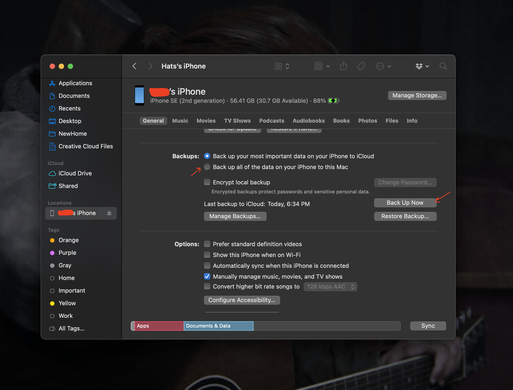

# Whatsapp: iOS -> Android Migration Tool
This tool is an all-in-one tool who does a complete migration from iOS to Android, without jailbraking or rooting your device.\
Hats off to awesome work of these two projects [Whatsapp Key Database Extractor](https://github.com/YuvrajRaghuvanshiS/WhatsApp-Key-Database-Extractor) , [iOSBackup](https://github.com/avibrazil/iOSbackup) which this project is partly based on for reading / writing whatsapp databases.

## Requirements:

- Python 3 (tested with python 3.9)
- Both Android and iPhone connected with USB
- Mac OS (Tested), UNIX (Not Tested, Should work), Windows (Not yet)

## IMPORTANT NOTE
> 
MAKE SURE YOU BACK UP THE DATA ON YOUR ANDROID DEVICE. 
> THE SCRIPT WILL DO ITS BEST TO PRESERVE, BUT BETTER SAFE THAN SORRY

### Step 1: Make an unencrypted backup from iphone
Below image explains.

### Step 2: Activate whatsapp on your new Android phone
Your data from iPhone will be there in your backup in last step. Setup whatsapp on your new device and it's avised to 
send a test message to someone. Database from iPhone will merge into current android database.

### Step 3: Install the requirements and run the script
run `iphone_to_android.py`and watch the console and do as it says! 
